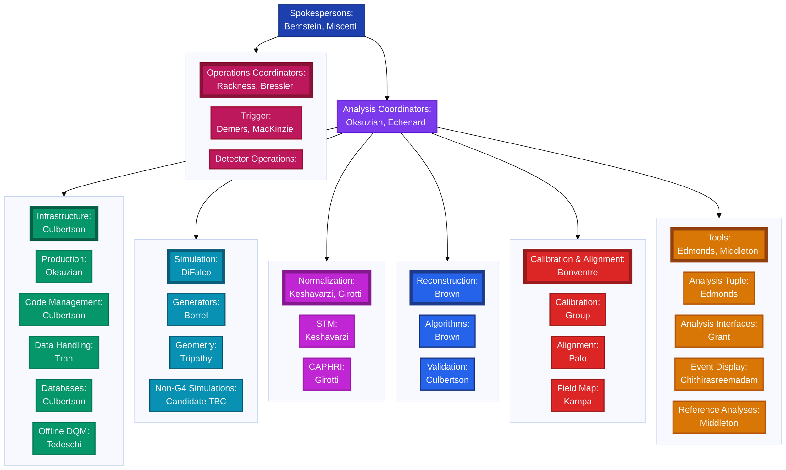

```mermaid
%%{init: { 'theme': 'base', 'flowchart': { 'htmlLabels': true, 'nodeSpacing': 20, 'rankSpacing': 30, 'padding': 5, 'useMaxWidth': false, 'curve': 'basis' }, 'securityLevel': 'loose' } }%%
graph TD
    SPK[Spokespersons:<br/>Bernstein, Miscetti&nbsp;]
    
    SPK --> AC[Analysis Coordinators:<br/>Oksuzian, Echenard&nbsp;]
    
    AC --> INFGROUP
    AC --> SIMGROUP
    AC --> NORMGROUP
    AC --> RECOGROUP
    AC --> CALGROUP
    AC --> TOOLSGROUP
    SPK --> OCGROUP
    
    subgraph INFGROUP[" "]
        INF[Infrastructure:<br/>Culbertson]
        PROD[Production:<br/>Oksuzian]
        CODE[Code Management:<br/>Culbertson]
        DATA[Data Handling:<br/>Tran]
        DB[Databases:<br/>Culbertson]
        DQM[Offline DQM:<br/>Tedeschi]
    end
    
    subgraph SIMGROUP[" "]
        SIM[Simulation:<br/>DiFalco]
        GEN[Generators:<br/>Borrel]
        GEOM[Geometry:<br/>Tripathy]
        NONG4[Non-G4 Simulations:<br/>Candidate TBC]
    end
    
    subgraph NORMGROUP[" "]
        NORM[Normalization:<br/>Keshavarzi, Girotti&nbsp;]
        STM[STM:<br/>Keshavarzi]
        CAPHRI[CAPHRI:<br/>Girotti]
    end
    
    subgraph RECOGROUP[" "]
        RECO[Reconstruction:<br/>Brown]
        ALG[Algorithms:<br/>Brown]
        VAL[Validation:<br/>Culbertson]
    end
    
    subgraph CALGROUP[" "]
        CAL[Calibration & Alignment:<br/>Bonventre]
        CALIB[Calibration:<br/>Group]
        ALIGN[Alignment:<br/>Palo]
        FMAP[Field Map:<br/>Kampa]
    end
    
    subgraph TOOLSGROUP[" "]
        TOOLS[Tools:<br/>Edmonds, Middleton&nbsp;]
        NTUP[Analysis Tuple:<br/>Edmonds]
        IFACE[Analysis Interfaces:<br/>Grant]
        EVD[Event Display:<br/>Chithirasreemadam]
        REF[Reference Analyses:<br/>Middleton]
    end
    
    subgraph OCGROUP[" "]
        OC[Operations Coordinators:<br/>Rackness, Bressler&nbsp;]
        TRIG[Trigger:<br/>Demers, MacKinzie&nbsp;]
        DETOPS[Detector Operations:<br/>]
    end
    
    classDef spokespersons fill:#1E40AF,stroke:#1E3A8A,stroke-width:2px,color:#fff
    classDef analysis fill:#7C3AED,stroke:#6D28D9,stroke-width:2px,color:#fff
    classDef operations fill:#BE185D,stroke:#9F1239,stroke-width:2px,color:#fff
    classDef tools fill:#D97706,stroke:#B45309,stroke-width:2px,color:#fff
    classDef infrastructure fill:#059669,stroke:#047857,stroke-width:2px,color:#fff
    classDef infrastructureLeader fill:#059669,stroke:#065F46,stroke-width:6px,color:#fff
    classDef simulation fill:#0891B2,stroke:#0C5D7A,stroke-width:2px,color:#fff
    classDef simulationLeader fill:#0891B2,stroke:#0C5D7A,stroke-width:6px,color:#fff
    classDef normalization fill:#C026D3,stroke:#A21CAF,stroke-width:2px,color:#fff
    classDef normalizationLeader fill:#C026D3,stroke:#86198F,stroke-width:6px,color:#fff
    classDef reconstruction fill:#2563EB,stroke:#1E3A8A,stroke-width:2px,color:#fff
    classDef reconstructionLeader fill:#2563EB,stroke:#1E3A8A,stroke-width:6px,color:#fff
    classDef calibration fill:#DC2626,stroke:#991B1B,stroke-width:2px,color:#fff
    classDef calibrationLeader fill:#DC2626,stroke:#991B1B,stroke-width:6px,color:#fff
    classDef toolsLeader fill:#D97706,stroke:#92400E,stroke-width:6px,color:#fff
    classDef operationsLeader fill:#BE185D,stroke:#881337,stroke-width:6px,color:#fff
    
    class SPK spokespersons
    class AC analysis
    class OC operationsLeader
    class TRIG,DETOPS operations
    class TOOLS toolsLeader
    class NTUP,IFACE,EVD,REF tools
    class INF infrastructureLeader
    class PROD,CODE,DATA,DB,DQM infrastructure
    class SIM simulationLeader
    class GEN,GEOM,NONG4 simulation
    class NORM normalizationLeader
    class STM,CAPHRI normalization
    class RECO reconstructionLeader
    class ALG,VAL reconstruction
    class CAL calibrationLeader
    class CALIB,ALIGN,FMAP calibration
```

