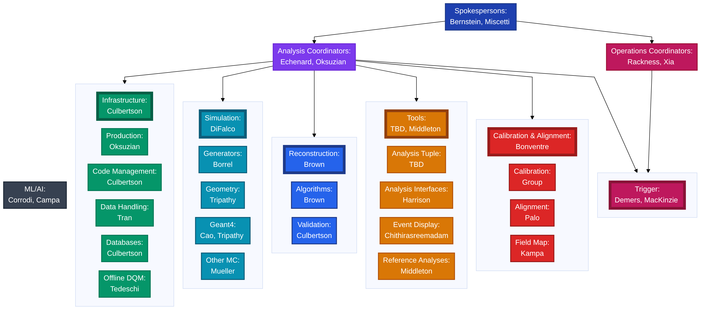
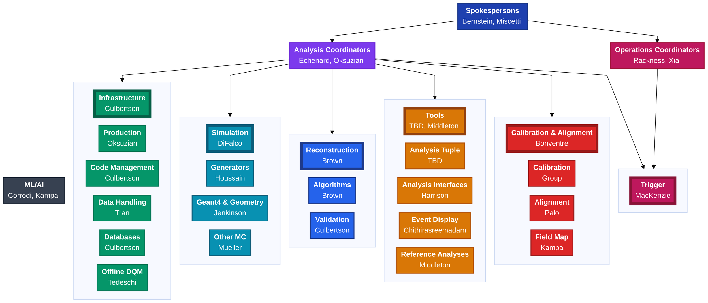

# Mu2e Analysis Computing Organization



Baseline: the official 2025-12 chart. The corrections below have been applied
on top of it, and the PNG above is rendered from the mermaid source at the
bottom of this file — the two are kept in sync by regenerating, never by
editing the image.

**Why the PNG and not a live mermaid block:** GitHub renders mermaid in its own
sandbox with `htmlLabels` and `securityLevel: loose` disabled, so the `<b>` and
`<br/>` markup these labels depend on comes out wrong there. The committed PNG
renders identically everywhere.

**Regenerating** — after editing the mermaid source, re-render and commit both:

````bash
DOC=docs/Mu2e_Analysis_Computing_Organization_2025-12_diagram

# pull the mermaid block out of this file
awk '/^```mermaid/{f=1;next} /^```$/{f=0} f' "$DOC.md" > /tmp/org.mmd

# note: unquoted heredoc, so $HOME expands
cat > /tmp/pptr.json <<JSON
{
  "executablePath": "$HOME/.cache/puppeteer/chrome/linux-131.0.6778.204/chrome-linux64/chrome",
  "args": ["--no-sandbox", "--disable-setuid-sandbox", "--disable-dev-shm-usage"]
}
JSON

mmdc -i /tmp/org.mmd -p /tmp/pptr.json -b white -s 2 -o "$DOC.png"
````

`mmdc` on mu2egpvm cannot resolve its own puppeteer cache even after
`npx @puppeteer/browsers install chrome@131.0.6778.204`, hence the explicit
`executablePath`. `--no-sandbox` is required; the gpvm has no user namespaces.
`-w` sets the viewport, not the output resolution — `-s` is the scale knob.

## Corrections since 2025-12

All from MacKenzie, org chat, 2026-08-12.

**Simulation subgroup:**

- **Geant4 and Geometry are a single subgroup**, and have been almost since the
  beginning. The 2025-12 chart still shows them split (`Geometry: Tripathy`,
  `Geant4: Cao, Tripathy`); they are merged here into one node.
- **Max Jenkinson (U. Manchester)** leads the merged Geant4 & Geometry subgroup.
- **Tausiff Houssain** leads Generators, replacing Borrel.
- Neither subgroup lead currently has experience modifying the Offline geometry,
  so those changes are being made by MacKenzie directly. Treat the chart as
  reporting lines, not as a routing table for geometry work.

**Leadership and spelling:**

- **Trigger is led by MacKenzie alone, with no deputy** — the 2025-12 chart
  lists `Demers, MacKinzie`.
- The surname is **MacKenzie**, not "MacKinzie".
- **Operations deputy is Lei Xia**, replacing Grant.
- ML/AI is **Corrodi, Kampa** — the chart spelled Cole Kampa's surname "Campa"
  in ML/AI while spelling it correctly under Field Map.

<details>
<summary>Mermaid source (edit here, then regenerate the PNG above)</summary>



</details>
